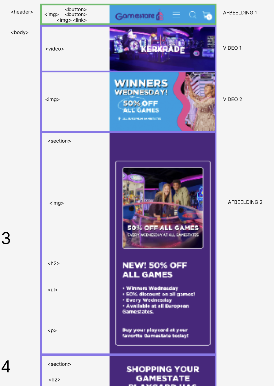
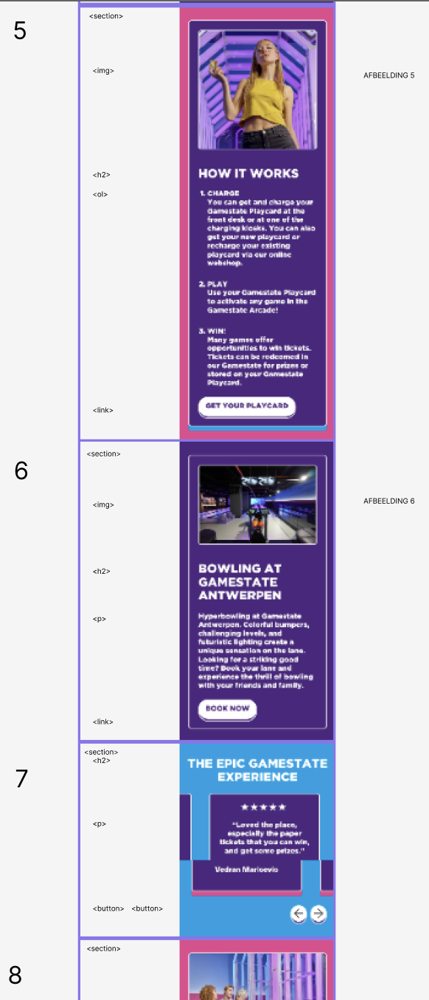
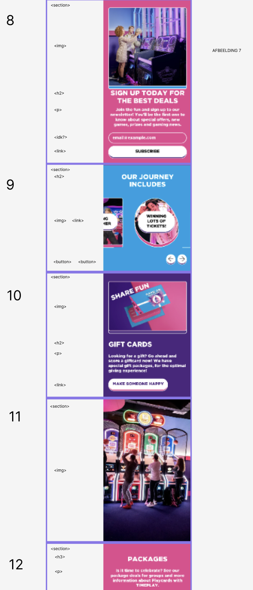
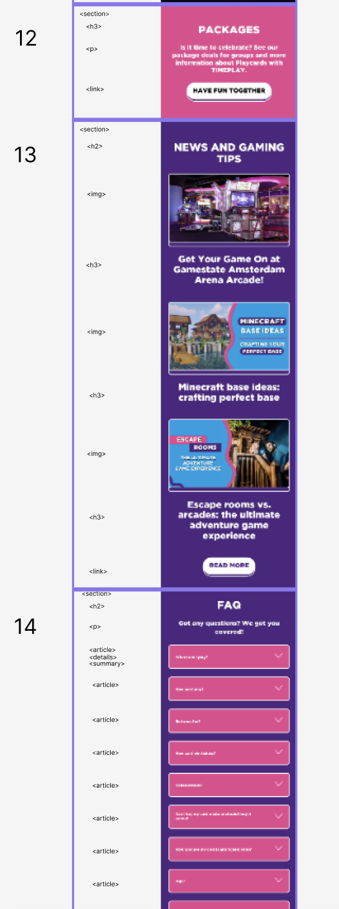
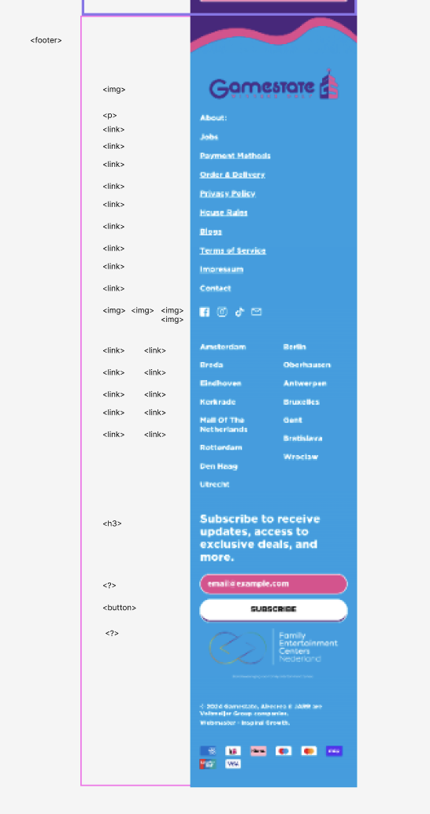

# Procesverslag
Markdown is een simpele manier om HTML te schrijven.  
Markdown cheat cheet: [Hulp bij het schrijven van Markdown](https://github.com/adam-p/markdown-here/wiki/Markdown-Cheatsheet).

Nb. De standaardstructuur en de spartaanse opmaak van de README.md zijn helemaal prima. Het gaat om de inhoud van je procesverslag. Besteedt de tijd voor pracht en praal aan je website.

Nb. Door *open* toe te voegen aan een *details* element kun je deze standaard open zetten. Fijn om dat steeds voor de relevante stuk(ken) te doen.

## Jij

  
uitwerken voor kick-off werkgroep

  ### Auteur:
  Lisanne Meeuwissen

  #### Je startniveau:
 Blauw

  #### Je focus:
surface plane
 

## Je website

  
uitwerken voor kick-off werkgroep

  ### Je opdracht:
  https://gamestate.com/

  #### Screenshot(s) van de eerste pagina (small screen): 
  GameState Home pagina  
  

  #### Screenshot(s) van de tweede pagina (small screen):
  GameState Store pagina
  
 

## Toegankelijkheidstest 1/2 (week 1)

  
uitwerken na test in 2e werkgroep

Tijdens de les heeft Laura voor mij naar mijn website gekeken en via de WCAG checklist deze na gekeken. 

  ### Bevindingen
  Lijst met je bevindingen die in de test naar voren kwamen:
  Hier uit is gekomen dat de website van Gamestate over het algemeen erg toegankelijk is wel zijn er een aantal punten waar rekening mee gehouden moet worden.
  - Validate HTML gaf veel errors - CSS errors en class errors en het mist alts.
  - Wanneer je door de website heen gaan met tab word content over geslagen.
  - Horizontaal scrollen is niet mogelijk.
  - Media kan niet op pauze worden gezet.
  - Animaties zijn niet subtiel (in ieder geval de gifjes/ videos).
  

## Breakdownschets (week 1)

  
uitwerken na afloop 3e werkgroep

  ### de hele pagina: 
  
  
  
  
  
  

## Voortgang 1 (week 2)

  
uitwerken voor 1e voortgang

  ### Stand van zaken
  Ik liep helaas erg vast op het begrijpen hoe mijn website in elkaar zat en wat de 1e elementen waren/ hoe ik deze toe moest voegen. Ik had wel al de breakdown schets gemaakt en was begonnen aan de 1e code. Ik had nooit eerder een video toe gevoegd aan een website dus hier liep ik erg vast. Verder heb ik samen met Sybren gekeken naar de structuur van de website, of mijn breakdown schets correct was en heb ik vragen kunnen stellen over hoe de html nu ookalweer in elkaar zat. Hierna heb ik zelfstandig de complete HTML kunnen maken.

  ### Agenda voor meeting
  samen met je groepje opstellen

  N.V.T.

  | student 1      | student 2          | student 3    | student 4        |
  | ---            | ---                | ---          | ---              |
  | dit bespreken  | en dit             | en ik dit    | en dan ik dat    |
  | en dat ook nog | dit als er tijd is | nog een punt | dit wil ik zeker |
  | ...            | ...                | ...          | ...              |

  ### Verslag van meeting
  hier na afloop snel de uitkomsten van de meeting vastleggen

  - Maak de HTML (bespreek dit tijdens les dinsdag)

## Voortgang 2 (week 3)

  
uitwerken voor 2e voortgang

  ### Stand van zaken
Ik ben klaar met de html en begonnen aan de CSS. Ik heb nog niet veel gepositioneerd maar ben begonnen met kleuren en kaders maken per sectie. 
Tijdens het gesprek gaf ik aan dat ik vast liep met de navigatie. Hierdoor heeft Sybren mij geholpen door samen de navigatie te maken. Hierna heb ik nog een aantal vragen kunnen stellen over hoe ik bepaalde elemeneten binnen mijn website het beste kon namaken.

  ### Agenda voor meeting
  samen met je groepje opstellen

  N.V.T.

  | student 1      | student 2          | student 3    | student 4        |
  | ---            | ---                | ---          | ---              |
  | dit bespreken  | en dit             | en ik dit    | en dan ik dat    |
  | en dat ook nog | dit als er tijd is | nog een punt | dit wil ik zeker |
  | ...            | ...                | ...          | ...              |

  ### Verslag van meeting
  hier na afloop snel de uitkomsten van de meeting vastleggen

  - Ga verder met de CSS

## Toegankelijkheidstest 2/2 (week 4)

  
uitwerken na test in 9e werkgroep

  ### Bevindingen
  Lijst met je bevindingen die in de test naar voren kwamen (geef ook aan wat er verbeterd is):

## Voortgang 3 (week 4)

  
uitwerken voor 3e voortgang

  ### Stand van zaken
  hier dit ging goed & dit was lastig (neem ook screenshots op van delen van je website en code)

  ### Agenda voor meeting
  samen met je groepje opstellen

  | student 1      | student 2          | student 3    | student 4        |
  | ---            | ---                | ---          | ---              |
  | dit bespreken  | en dit             | en ik dit    | en dan ik dat    |
  | en dat ook nog | dit als er tijd is | nog een punt | dit wil ik zeker |
  | ...            | ...                | ...          | ...              |

  ### Verslag van meeting
  hier na afloop snel de uitkomsten van de meeting vastleggen

  - punt 1
  - punt 2
  - nog een punt
  - ...

## Eindgesprek (week 5)

  
uitwerken voor eindgesprek

  ### Je uitkomst - karakteristiek screenshots:
  

  ### Dit ging goed/Heb ik geleerd: 
  Korte omschrijving met plaatjes

  

  ### Dit was lastig/Is niet gelukt:
  Korte omschrijving met plaatjes

  

## Bronnenlijst

  
continu bijhouden terwijl je werkt

  Nb. Wees specifiek ('css-tricks' als bron is bijv. niet specifiek genoeg). 
  Nb. ChatGpT en andere AI horen er ook bij.
  Nb. Vermeld de bronnen ook in je code.

  1. ::before en ::after element (hoe werkt het?)  https://www.youtube.com/watch?v=dIUOWdwwZBw
  2. bron 2
  3. pijltjes voor knoppen sectie 7 en dropdown menu's https://www.w3schools.com/charsets/ref_utf_arrows.asp

